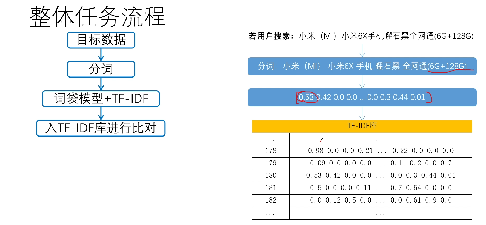
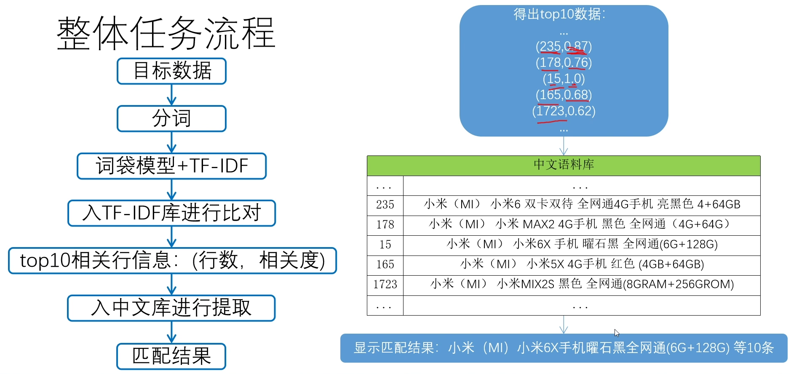

# Similarity_matching_system
这个是一个《电商标题数据相似度匹配系统》，使用方法有：tfidf+词袋模型，余弦相似度，word2vec
# 1.基本方法
## 1.1 结巴分词
[结巴分词在这里](https://github.com/JackKuo666/Similarity_matching_system/blob/master/jieba_tfidf/%E7%BB%93%E5%B7%B4%E5%88%86%E8%AF%8D.ipynb)

## 1.2 TF-IDF
[TF-IDF](https://github.com/JackKuo666/Similarity_matching_system/blob/master/jieba_tfidf/tf-idf.ipynb)

## 1.3 余弦相似度
[余弦相似度](https://github.com/JackKuo666/Similarity_matching_system/blob/master/cosine_similarity/%E4%BD%99%E5%BC%A6%E7%9B%B8%E4%BC%BC%E5%BA%A6.ipynb)

## 1.4 word2vec
[word2vec](https://github.com/JackKuo666/Similarity_matching_system/blob/master/word2vec/word2vce.ipynb)

# 2.项目：《电商标题数据相似度匹配系统》
## 2.1 项目原理

## 2.2 项目代码
[《电商标题数据相似度匹配系统》](https://github.com/JackKuo666/Similarity_matching_system/blob/master/Task/tfidf_task.ipynb)
